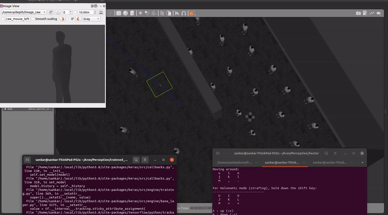

# Drone Obstacle Avoidance Using Imitation Learning

This repository contains the implementation of a drone obstacle avoidance system leveraging imitation learning. The project demonstrates the application of machine learning to train drones to navigate through environments while avoiding obstacles, inspired by human behavior.

## Overview
The goal of this project is to implement a drone navigation system that uses imitation learning to learn obstacle avoidance behavior from expert demonstrations through image inputs. Imitation learning enables the drone to mimic decisions made by a human or a pre-trained model, allowing efficient navigation through complex environments. This project is implemented in ROS 1 noetic along with gazebo. The drone model is taken from hector_quardrotor and it is used for this simulation purposes. Training is done using a alexnet based model with tensorflow implementation. THe trained model is available in the "trained model folder"




## Installation
Clone the repository:
```bash
git clone https://github.com/aravindprakash9/Drone-obstracle-avoidance-using-immitation-learning.git
cd Drone-obstracle-avoidance-using-immitation-learning
```
Create Conda environment and Build the packages:
```bash
conda env create -f environment.yml
conda activate obs_avoid
catkin make
```
